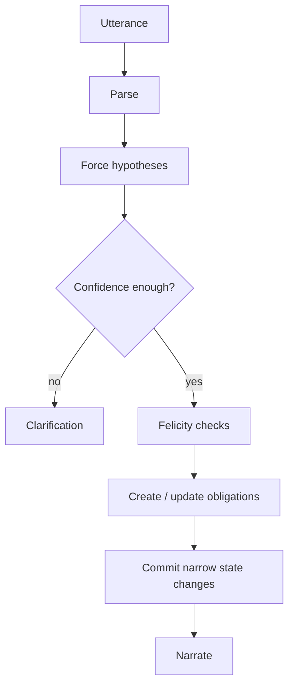

# Vol 2 — Speech Acts & Force
**The Biblioteca — Volume 2**
**Subtitle:** *What an utterance is doing, what it obligates next, and how to make that inspectable in a deterministic engine.*

> Companion to Vol 1. If Vol 1's thesis is **interpret richly, commit narrowly**, Vol 2 is the first place to operationalize that thesis.  
> The practical point is simple: **before a line of dialogue can affect canon, the engine should know what kind of move it is trying to make.**

---

## 0. Executive summary

This volume treats dialogue as **action**, not just content. A line of text may assert, ask, request, threaten, challenge, accuse, promise, refuse, apologize, warn, deflect, or do several of these at once. That "what-it-is-doing" layer is usually called **illocutionary force** in speech-act theory. Classic work in philosophy of language and dialogue systems converges on the same computational lesson:

1. **Literal wording is not enough.**
2. **Force is partly inferred from context, scene, role, and uptake.**
3. **Once force is recognized, it creates predictable expectations and obligations.**
4. **Those expectations can be represented explicitly and tested.**

For Immortal, that means a player line should not directly become world truth or scene outcome. It should first become a **typed pragmatic packet** with force-level fields. From there, rules can decide:
- whether the move is legal in the scene,
- what obligations it creates,
- whether clarification is required,
- and which canonical state updates are allowed.

**Core design claim:**  
**Dialogue force belongs in deterministic runtime state.**  
Not because every utterance can be perfectly classified, but because enough of them can be classified *well enough* to create a stable, inspectable control layer.

---

## 1. Why "force" matters more than wording

Players rarely speak in clean command syntax. They say things like:

- "Can you move?"  
- "You really want to stand in my way?"  
- "If that relic goes missing, I assume you'll be helping me find it."  
- "So you admit you were there."  
- "Fine."  
- "Sure, whatever you say."  

The literal semantics underspecify the social move. The same surface form can be:

- a genuine information request,
- a request disguised as a question,
- a threat disguised as a question,
- a face-saving concession,
- sarcastic compliance,
- or a refusal cloaked in politeness.

That is why speech-act theory matters. Austin distinguished between:
- **locutionary** content (roughly, what is said),
- **illocutionary** force (what act is performed in saying it),
- **perlocutionary** effect (what it causes in the listener).  

Searle systematized this into act classes such as assertions, directives, commissives, expressives, and declarations. In practical runtime terms:

| Layer | Question |
|---|---|
| Locution | What was literally said? |
| Illocution / force | What move is being attempted? |
| Perlocution | What effect does it have? |

For engine purposes, **illocution is the hinge**. It links utterance interpretation to legal consequences.

---

## 2. The canonical act families

No taxonomy is final. But most systems benefit from a stable top level.

### 2.1 Assertives / representatives
Speaker presents a proposition as true.

Examples:
- "The duke is dead."
- "I saw her at the gate."
- "You're lying."

Typical runtime effects:
- proposes content for common ground,
- may update belief models,
- may trigger evidence/challenge mechanics,
- may create accountability for truthfulness.

### 2.2 Directives
Speaker tries to get the hearer to do something.

Examples:
- "Open the door."
- "Tell me where he went."
- "Can you hand me that?"
- "Step aside."

Typical runtime effects:
- creates compliance/refusal branch,
- may invoke authority/rank checks,
- may escalate if resisted,
- may change stance if framed politely vs coercively.

### 2.3 Commissives
Speaker commits themselves to a future act.

Examples:
- "I will repay you."
- "I swear I won't tell anyone."
- "You'll have my sword."
- "If you help me, I owe you one."

Typical runtime effects:
- creates obligation or debt token,
- affects trust/reputation,
- can be logged as future-fulfillment hook.

### 2.4 Expressives
Speaker displays attitude, feeling, or evaluation.

Examples:
- "I'm sorry."
- "Thank you."
- "Damn you."
- "Congratulations."

Typical runtime effects:
- changes relational state,
- may repair or damage face,
- may not directly change world facts.

### 2.5 Declarations
The act itself changes institutional/social reality if the speaker has standing and context is right.

Examples:
- "I sentence you."
- "You are under arrest."
- "I knight you."
- "I pronounce you husband and wife."

Typical runtime effects:
- immediate state change if authority + protocol conditions hold,
- otherwise the act fails or becomes merely attempted/usurped.

### 2.6 Meta-dialogue acts
Acts about the conversation itself.

Examples:
- "Answer the question."
- "That's not what I asked."
- "Let me finish."
- "Are we negotiating or arguing?"
- "Clarify."

Typical runtime effects:
- changes turn structure, focus, repair state, or allowed next moves.

---

## 3. Force is not the same as sentence form

A key error in naive systems is mapping:
- declarative -> assertion
- interrogative -> question
- imperative -> command

That mapping fails constantly.

Examples:

| Surface form | Likely force |
|---|---|
| "Can you open the window?" | request, not ability query |
| "Would you mind leaving?" | request / dismissal |
| "Do I look stupid?" | challenge / accusation / complaint |
| "Nice job." | praise or sarcasm, depending on context |
| "You might want to lower your voice." | warning / threat / advice |
| "If I were you, I'd leave." | advice or veiled threat |

So the engine needs a distinction between:
- **grammatical mood** (declarative/interrogative/imperative),
- **candidate force**,
- **confidence / ambiguity**.

A good principle is:

> **Treat surface form as evidence, not authority.**

---

## 4. Direct vs indirect force

Indirect speech acts are a major source of human flexibility. They let people be polite, strategic, deniable, or manipulative.

### 4.1 Why humans use indirectness
Common reasons:
- politeness / face-saving,
- uncertainty about authority,
- plausible deniability,
- social ritual,
- testing willingness without direct commitment,
- softening threats or demands,
- preserving relationship while signaling pressure.

### 4.2 Common indirect directive patterns
- Ability questions: "Can you...?"
- Willingness questions: "Would you...?"
- Need-state hints: "It's cold in here."
- Norm reminders: "Guests usually wait outside."
- Conditional threats/advice: "If I were you..."
- Presumptive imperatives: "You'll want to..."
- Courtesy formulae: "Could I ask you to..."

### 4.3 Engine implication
Indirect force should usually be represented as:
- `surface_force`
- `inferred_force`
- `directness_level`
- `plausible_alternatives`

Example packet:

```json
{
  "surface_form": "interrogative",
  "surface_force": "question",
  "inferred_force": "request",
  "directness_level": "indirect",
  "target": "listener",
  "action_candidate": "open_window",
  "confidence": 0.82,
  "alternatives": ["ability_query"]
}
```

This avoids the false choice between "literal only" and "model intuition only."

---

## 5. Mixed-force utterances

Many lines do more than one thing.

Examples:
- "I'm sorry, but you need to leave." -> apology + directive
- "If you touch her again, I will kill you." -> conditional assertion + threat + commissive
- "You were at the scene, weren't you?" -> question + accusation + presupposition
- "With all due respect, that's idiotic." -> politeness marker + insult
- "Fine, I'll do it." -> acceptance or resentful compliance depending on stance

A robust packet therefore needs:
- **primary force**
- **secondary force(s)**
- **stance**
- **embedded presuppositions**
- **polarity** (supportive, hostile, neutral, submissive, etc.)

Possible representation:

```json
{
  "primary_force": "directive",
  "secondary_forces": ["expressive"],
  "stance": "irritated",
  "embedded_moves": ["apology"],
  "confidence": 0.77
}
```

For Immortal, mixed-force modeling is often better than trying to force one label.

---

## 6. Force creates obligations

This is the most important computational move in the volume.

### 6.1 From speech acts to dialogue obligations
A recognized force often creates a **conditional relevance** relation: certain next moves become expected, licensed, or urgent.

Examples:
- a question creates an obligation to answer / decline / defer / challenge,
- an accusation creates pressure to deny / admit / deflect / counteraccuse,
- a promise creates later accountability,
- a command creates a compliance / refusal / negotiation branch,
- an apology invites acceptance / rejection / cold acknowledgment.

This is closely related to adjacency-pair thinking in conversation analysis and to explicit **discourse obligations** in dialogue processing.

### 6.2 Why obligations matter in games
Without obligations, dialogue becomes mush:
- NPCs ignore accusations,
- questions vanish,
- players derail coherence with evasions,
- tone is simulated but not structurally enforced.

With obligations, a scene gains skeleton:
- unanswered questions remain "live,"
- accusations linger until addressed,
- an offer expects acceptance / rejection / counteroffer,
- public challenges demand visible handling.

### 6.3 Suggested obligation object

```json
{
  "obligation_id": "obl_0142",
  "source_turn": 87,
  "trigger_force": "question",
  "holder": "npc.guard.captain",
  "owed_to": "player",
  "required_response_set": ["answer", "refuse", "defer", "challenge_presupposition", "counterquestion"],
  "deadline": "before_topic_close",
  "priority": "high",
  "public_visibility": "present_witnesses",
  "status": "open"
}
```

### 6.4 Minimal obligation ladders

**Question**
- answer
- refuse
- defer
- challenge premise
- answer partially
- request clarification
- counterquestion

**Accusation**
- deny
- admit
- justify
- deflect
- counteraccuse
- challenge evidence
- appeal to authority
- exit / refuse

**Command**
- comply
- refuse
- negotiate
- stall
- challenge authority
- feign compliance

**Offer**
- accept
- reject
- counteroffer
- request terms
- stall

**Apology**
- accept
- reject
- accept provisionally
- demand repair
- ignore

This ladder logic is immediately useful for turn-to-turn coherence.

---

## 7. Adjacency pairs, insertion, and turn skeletons

Conversation analysis identified recurring paired structures:
- greeting -> greeting
- question -> answer
- offer -> accept/reject
- request -> grant/refuse
- accusation -> denial/admission/deflection (less canonical in CA, but structurally comparable)

These are not rigid scripts. They are **expectation frames**.

### 7.1 Insertion sequences
A second speaker may delay the expected second part by inserting a subexchange.

Example:
- A: "Can I borrow your horse?"
- B: "When would you return it?"
- A: "By dawn."
- B: "Then yes."

The original request stays open while a clarification subthread runs.

### 7.2 Engine implication
An obligation system should support:
- `open`
- `suspended_by_subdialogue`
- `resolved`
- `abandoned`
- `forcibly_closed`

That lets you support realistic dialogue without losing coherence.

---

## 8. Repair and grounding

Not every utterance should commit. Sometimes the correct outcome is **repair**.

### 8.1 Grounding
Clark and Schaefer's work treats conversation as collaborative action where contributions require sufficient mutual understanding for current purposes. A contribution is not fully done just because words were spoken; uptake matters.

### 8.2 Repair
Repair handles trouble in hearing, understanding, reference, force, or relevance.

Common repair triggers:
- ambiguous referent: "him" / "that one"
- ambiguous force: "Was that a request or a threat?"
- mishearing / low confidence
- scene-inappropriate act
- conflict with known state
- contradictory commitments
- possible sarcasm/irony mismatch
- absurd action intent

### 8.3 Repair as first-class outcome
In Immortal terms, repair/clarification should be a **legal action**, not a failure of the system.

Canonical examples:
- "Which guard do you mean?"
- "Are you asking politely, or ordering him?"
- "Do you want to threaten him, persuade him, or bribe him?"
- "When you say 'take it,' do you mean quietly or by force?"

### 8.4 Packet support for repair

```json
{
  "clarification_needed": true,
  "clarification_reason": ["force_ambiguity", "referent_ambiguity"],
  "clarification_options": [
    "ask_vs_order",
    "quiet_theft_vs_overt_theft"
  ],
  "commit_blocked": true
}
```

This is where dialogue intelligence becomes deterministic discipline rather than "model mood."

---

## 9. Uptake and failed acts

A speech act can fail. This matters enormously in games.

Examples:
- a declaration fails because the speaker lacks authority,
- a promise fails socially because the hearer does not accept the commitment,
- an apology is heard but not accepted,
- an order is interpreted as insolence because rank conditions are absent,
- a threat fails because it is not credible,
- a request fails because it was not recognized as one.

The runtime question is not only **what act was attempted?** but also:
- **was it recognized?**
- **was it felicitous?**
- **was it accepted, resisted, mocked, ignored, or reframed?**

Suggested status fields:

```json
{
  "attempted_force": "declaration",
  "recognized_force": "declaration",
  "felicity": "failed_authority_condition",
  "uptake": "contested",
  "canonical_effects_applied": false
}
```

---

## 10. Felicity conditions: when acts are socially/legal valid

Austin and Searle's descendants often discuss **felicity conditions**: the background conditions under which an act can succeed.

This is gold for deterministic engines.

### 10.1 Example: order
Conditions may include:
- speaker has standing,
- scene allows commands,
- target can understand,
- demanded action is feasible,
- no overriding prohibition,
- the utterance is recognized as directive.

### 10.2 Example: promise
Conditions may include:
- speaker controls the future act,
- commitment is intelligible,
- hearer understands commitment,
- context treats commitments as binding,
- promise not obviously impossible.

### 10.3 Example: declaration
Conditions may include:
- authorized role,
- correct ritual/procedure,
- correct object/person,
- proper venue/context,
- no disqualifying defect.

This maps naturally to a rule engine:
- `force_candidate`
- `felicity_checks`
- `success | partial | failed | transformed`

---

## 11. Stance: the emotional/social vector on the act

Force tells you **what move** was attempted. Stance tells you **how** it was delivered.

Useful stance axes:
- hostile / neutral / supportive
- deferential / equal / domineering
- sincere / performative / ironic
- calm / agitated / panicked
- respectful / contemptuous
- cooperative / adversarial

Why this matters:
- "Leave." as a calm request differs from "Leave." as a threat.
- "Thank you." can be sincere or cutting.
- "Fine." can be acceptance, surrender, or refusal-by-tone.

Suggested stance packet:

```json
{
  "stance": {
    "valence": "negative",
    "dominance": "high",
    "cooperativeness": "low",
    "sincerity_estimate": 0.63,
    "irony_possible": true
  }
}
```

You do not need perfect psychology. You need enough structure to affect lawful outcomes.

---

## 12. Targeting: who is the act aimed at?

Dialogue in games often occurs before multiple audiences. Force can be aimed at:
- the addressee,
- a bystander,
- a whole crowd,
- the court record,
- the speaker's ally,
- the self (vows, self-binding),
- an absent party (public declaration).

This matters because the same line can do different things for different targets.

Example:
> "Of course I trust the captain."

Possible layered effects:
- reassure captain,
- signal caution to ally,
- preserve face before witnesses,
- create deniability.

At minimum, force packets should distinguish:
- `primary_addressee`
- `public_audience`
- `hidden_target` (if inferred)
- `witness_scope`

This becomes even more important in Vol 5 (deception/audience split), but the foundations belong here.

---

## 13. Commands, requests, threats, warnings: the confusion cluster

These are easy to blur. They should not be conflated.

### 13.1 Request
Goal: listener performs action voluntarily.  
Typical social frame: cooperation.  
Negative consequence of refusal: maybe disappointment, not necessarily sanction.

### 13.2 Command / order
Goal: listener performs action under authority structure.  
Refusal may count as insubordination.

### 13.3 Threat
Speaker commits to harmful consequence if condition unmet.

### 13.4 Warning
Speaker informs about harmful consequence, which may occur independently of speaker agency.

Examples:
- "Leave now." -> directive, ambiguous request/order.
- "Leave now or I'll have you arrested." -> directive + threat.
- "Leave now or the crowd will tear you apart." -> directive + warning.
- "You should leave now." -> advice / warning / soft command depending on scene.

This cluster is a prime clarification target because the consequences differ.

---

## 14. Accusations, challenges, and confrontations

Games need richer conflict dialogue than mere question/answer.

### 14.1 Accusation
Speaker attributes wrongdoing, responsibility, or falsehood.

Typical consequences:
- creates defense obligation,
- may reduce status/trust,
- may provoke evidence contest,
- may change witness beliefs even before resolution.

### 14.2 Challenge
Speaker contests claim, status, authority, or courage.

Examples:
- "Prove it."
- "Say that again."
- "You call yourself a knight?"
- "Then draw."

Challenges often alter the **mode** of the scene. They are not mere assertions.

### 14.3 Confrontation packet additions
Useful fields:
- `face_threat_level`
- `demand_for_justification`
- `evidence_requested`
- `escalation_risk`
- `publicity`

These acts are especially important for "social physics."

---

## 15. Refusal is not one thing

Systems often model refusal as binary. Human dialogue has many refusal styles:
- direct refusal,
- polite refusal,
- justified refusal,
- delay,
- evasive non-answer,
- procedural refusal,
- refusal by challenge,
- refusal by counteroffer,
- refusal by silence,
- refusal masked as inability.

Examples:
- "No."
- "I can't."
- "Not without a warrant."
- "Ask me tomorrow."
- "Why should I?"
- "That's above my station."
- [silence]

For runtime, refusal style matters because it shapes:
- face damage,
- escalation,
- authority contest,
- relation effects,
- future openness.

---

## 16. Silence, non-response, and delayed uptake

Silence is often meaningful:
- refusal,
- shock,
- contempt,
- fear,
- deference,
- tactical delay,
- confusion,
- grief,
- not hearing.

A system should avoid collapsing silence into "nothing happened."

Possible fields:
- `response_absence_type`: unknown / strategic / intimidated / processing / disengaged
- `open_obligations_persist`: true
- `scene_interpretation_default`: configured by scene mode

In court, silence may imply one thing; in ritual, another; in a romance scene, another.

---

## 17. Force in scene protocols

Force does not live in a vacuum. Scene mode changes legal interpretation.

Examples:
- "Kneel." in battle, court, ritual, and bedroom are different acts.
- "You will answer me." in court may be procedural; in a tavern it may be bluster.
- "I accept." in bargaining, marriage, duel ritual, and military oath have different force profiles.

So act interpretation should be conditioned by:
- scene mode,
- role/rank,
- institution,
- taboo rules,
- witness scope,
- current tension.

This is where Vol 4 will deepen the picture. For now:
> **Force is partially scene-relative.**

---

## 18. Minimal pragmatic packet for force

Here is a recommended minimal inspectable object.

```json
{
  "utterance_id": "u_0088",
  "literal_proposition": ["guard_should_move"],
  "surface_form": "interrogative",
  "primary_force": "directive",
  "secondary_forces": [],
  "directness_level": "indirect",
  "stance": {
    "valence": "neutral",
    "dominance": "medium",
    "cooperativeness": "medium"
  },
  "target": {
    "primary_addressee": "npc.guard.1",
    "audience_scope": "local_public"
  },
  "scene_binding": {
    "scene_mode": "checkpoint",
    "role_relation": "civilian_to_guard"
  },
  "obligations_created": [
    {
      "holder": "npc.guard.1",
      "type": "respond_to_request",
      "options": ["comply", "refuse", "question", "challenge_authority", "ignore"]
    }
  ],
  "felicity": {
    "status": "valid_attempt",
    "failed_conditions": []
  },
  "clarification": {
    "needed": false,
    "reason": []
  },
  "confidence": 0.84
}
```

That is already enough to make dialogue dramatically more coherent.

---

## 19. Five-stage runtime pattern

Vol 1 laid out the broader architecture. For force handling, the core pattern is:

### Stage 1 — Parse
Extract candidate propositions, entities, mood, action terms, social markers.

### Stage 2 — Hypothesize force
Generate bounded candidates:
- question,
- request,
- command,
- threat,
- accusation,
- promise,
- apology,
- challenge,
- etc.

### Stage 3 — Constrain
Use scene state, role, rank, recent obligations, witness scope, known plans, and confidence gates to narrow legal interpretations.

### Stage 4 — Commit narrowly
Create/update:
- open obligations,
- relation deltas,
- challenge states,
- pledge tokens,
- procedural transitions,
- or clarification requests.

### Stage 5 — Narrate
LLM or template realizes the outcome in voiced form. Narration is downstream of the committed packet and never the authority.

---

## 20. Failure modes in existing systems

### 20.1 Surface-form literalism
Treating "Can you X?" as ability question only.

### 20.2 Pure vibe interpretation
Letting an LLM guess force without inspectable state or fallback.

### 20.3 No obligations
Important questions and accusations disappear on the next turn.

### 20.4 No repair path
Ambiguous lines are forced into canon instead of clarified.

### 20.5 Collapsing request/order/threat
This destroys both social realism and lawful consequence.

### 20.6 No felicity checks
Declarations or commands "work" even without authority or protocol.

### 20.7 No multi-audience model
Public speech has the same effects as private speech.

### 20.8 No uptake distinction
Attempted act and successful act are conflated.

---

## 21. Design implications for Immortal

This is the actionable core.

### 21.1 Promote ad hoc detectors into a packet layer
You already have informal speech-act detectors and clarifiers. The next step is formalization:
- `force`
- `directness`
- `target`
- `stance`
- `obligations_created`
- `felicity`
- `clarification_needed`

### 21.2 Make clarification a normal lawful outcome
Not an error case. If force ambiguity is outcome-relevant, block commit and ask.

### 21.3 Track open obligations across turns
Questions, accusations, offers, challenges, and promises should persist until resolved, abandoned, or superseded.

### 21.4 Separate attempted act from accepted effect
An order can be attempted and rejected. An apology can be offered and refused. A declaration can fail.

### 21.5 Scene-mode conditioning
Interpretation should be aware of current social protocol, even in a lightweight way.

### 21.6 Keep narration downstream
Text generation may realize tone and style, but the canonical move is whatever the packet says it is.

---

## 22. Suggested schema for implementation packets

```ts
type ForceKind =
  | "assertion"
  | "question"
  | "request"
  | "command"
  | "offer"
  | "promise"
  | "threat"
  | "warning"
  | "apology"
  | "thanks"
  | "accusation"
  | "challenge"
  | "refusal"
  | "concession"
  | "meta_dialogue"
  | "declaration"
  | "other";

type PragmaticForcePacket = {
  utteranceId: string;
  literalPropositions: string[];
  surfaceForm: "declarative" | "interrogative" | "imperative" | "fragment" | "other";
  primaryForce: ForceKind;
  secondaryForces: ForceKind[];
  directness: "direct" | "indirect" | "highly_indirect";
  stance: {
    valence: "positive" | "neutral" | "negative" | "mixed";
    dominance: "low" | "medium" | "high";
    cooperativeness: "low" | "medium" | "high";
    ironyPossible: boolean;
  };
  target: {
    primaryAddressee?: string;
    audienceScope: "private" | "local_public" | "broad_public";
  };
  sceneBinding: {
    sceneMode?: string;
    roleRelation?: string;
  };
  obligationsCreated: DialogueObligation[];
  felicity: {
    status: "valid_attempt" | "failed" | "contested" | "partial";
    failedConditions: string[];
  };
  clarification: {
    needed: boolean;
    reason: string[];
    candidateQuestions?: string[];
  };
  confidence: number;
};
```

This does not need to appear all at once in production. But it is the architectural target.

---

## 23. Minimal rule tables worth building first

If this subsystem graduates incrementally, the highest-value early tables are:

1. **Question obligations**
2. **Request / order / threat distinction**
3. **Accusation response ladders**
4. **Offer / bargain response ladders**
5. **Clarification triggers for force ambiguity**
6. **Declaration felicity checks**
7. **Promise / debt token creation**
8. **Public vs private audience modifiers**

These will buy much more coherence than early sarcasm sophistication.

---

## 24. Research/library notes to carry forward

This volume draws most directly from:
- Austin on speech acts and felicity,
- Searle on act classes,
- Clark and Schaefer on grounding and contribution,
- conversation-analysis work on adjacency and repair,
- Traum on discourse obligations and grounding acts,
- practical dialogue-system literature on dialogue acts,
- Vol 1 precedents like Talk of the Town and Versu, which show how dialogue moves can drive simulation.

For Immortal, the main bridge is:
> **speech act -> open obligation / legal response set -> narrow canonical update**

That is the deterministic heart of "social physics."

---

## 25. Minimal checklist

Before a line changes canon, ask:

- What is the best current force hypothesis?
- What alternatives are still plausible?
- Is clarification required?
- What obligations does this act create?
- Is the act felicitous in this scene?
- Is the act public or private?
- Does it commit only proposition, or also relation/procedure/debt?
- Has narration been kept downstream?

If these are answerable, the system is already far ahead of pure text-play.

---

## Appendix A — Worked examples

### A1. "Can you move?"
- surface form: interrogative
- likely force: request
- alternatives: ability question
- obligation created: respond_to_request
- clarification needed: no, unless scene stakes are high

### A2. "Do I look like a fool to you?"
- surface form: interrogative
- likely force: challenge / accusation / complaint
- obligation created: face-relevant response
- likely safe responses: denial, apology, reassurance, escalation

### A3. "If I were you, I'd leave."
- surface form: declarative conditional
- likely forces: advice or veiled threat
- clarification may be needed if threat vs advice changes legality

### A4. "I hereby strip you of rank."
- surface form: declarative
- force: declaration
- felicity checks: authority, context, institution
- if failed: attempted usurpation / bluster, not actual demotion

### A5. "Fine."
- fragment
- force ambiguous: acceptance, resentful compliance, refusal-by-tone
- likely requires contextual disambiguation; may stay as weak-commit until uptake

---

## Appendix B — Packet/obligation interaction sketch



---

## Appendix C — Select bibliography / starting points

### Foundational theory
- Austin, J. L. *How to Do Things with Words*. Harvard University Press, 1962.
- Searle, John R. *Speech Acts*. Cambridge University Press, 1969.
- Searle, John R. "A Classification of Illocutionary Acts." *Language in Society* 5(1), 1976.
- Bach, Kent, and Robert Harnish. *Linguistic Communication and Speech Acts*. MIT Press, 1979.

### Reference entries / accessible syntheses
- Stanford Encyclopedia of Philosophy — "Speech Acts"
- Stanford Encyclopedia of Philosophy — "Assertion"
- Jurafsky & Martin — chapter on dialogue and conversational agents

### Conversation, grounding, obligations
- Clark, Herbert H. *Using Language*. Cambridge University Press, 1996.
- Clark, Herbert H., and Edward F. Schaefer. "Contributing to Discourse." *Cognitive Science* 13(2), 1989.
- Clark, Herbert H. "Grounding in Communication." In *Perspectives on Socially Shared Cognition*, 1991.
- Traum, David R. "Discourse Obligations in Dialogue Processing." ACL, 1994.
- Traum, David R. "On Clark and Schaefer's Contribution Model and its Applicability to Human-Computer Collaboration." 1998.
- Sacks, Harvey; Schegloff, Emanuel; Jefferson, Gail. "A Simplest Systematics for the Organization of Turn-Taking for Conversation." *Language*, 1974.
- Schegloff, Emanuel A., and Harvey Sacks. "Opening Up Closings." *Semiotica*, 1973.

### Computational dialogue acts
- Stolcke, Andreas et al. "Dialog Act Modeling for Conversational Speech." *Computational Linguistics* 26(3), 2000.
- Jurafsky, Daniel, and James H. Martin. *Speech and Language Processing* (dialogue chapters).

### Game / interactive-system precedents
- Ryan, James et al. "Dialogue Generation in Talk of the Town." AAAI, 2016.
- Evans, Richard, and Emily Short. *Versu* / social-practice related papers and talks.
- Mateas, Michael, and Andrew Stern. "Façade: An Experiment in Building a Fully-Realized Interactive Drama." 2003.

---

## Closing note

Vol 2's claim is deliberately narrow and practical:

> The engine does not need to solve human conversation in general.  
> It needs to recognize enough **force**, **obligation**, **repair**, and **felicity** structure to stop treating every line as untyped text.

That shift alone turns conversation from narration garnish into a rules-bearing subsystem.
